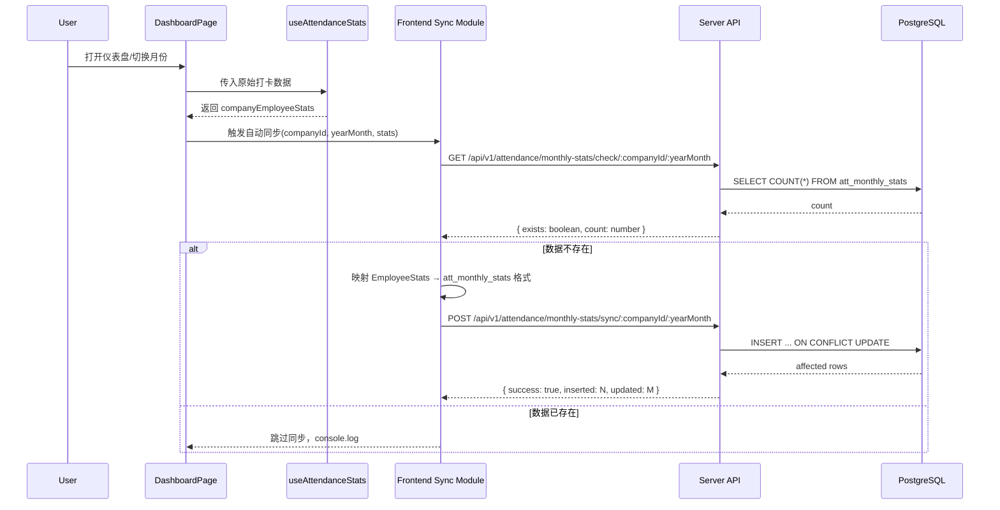

# Design Document: 考勤数据自动入库

## Overview

本设计实现考勤数据从前端自动持久化到PostgreSQL数据库的完整流程。当用户在仪表盘页面加载考勤数据后，系统自动将 `useAttendanceStats` Hook 计算出的 `EmployeeStats` 月度统计数据写入 `att_monthly_stats` 表。

核心设计原则：
- 幂等性：重复触发不会产生重复数据（基于唯一约束的upsert）
- 非阻塞：同步过程不影响前端渲染和用户交互
- 先检查后写入：通过存在性检查避免不必要的网络请求

## Architecture



## Components and Interfaces

### 1. 数据库迁移（Migration 009）

扩展所有 `att_*` 表的 `company_id` 枚举，新增 `naoli`、`haike`、`qianbing` 三个值。

使用 PostgreSQL 原生 ALTER TYPE 语法，因为 Knex 不直接支持修改 enum 类型。

```sql
ALTER TYPE att_daily_company_id_enum ADD VALUE IF NOT EXISTS 'naoli';
ALTER TYPE att_daily_company_id_enum ADD VALUE IF NOT EXISTS 'haike';
ALTER TYPE att_daily_company_id_enum ADD VALUE IF NOT EXISTS 'qianbing';
-- 对每个表的 enum 类型重复执行
```

### 2. 服务端 - MonthlyStatsSyncService

新增服务文件 `server/src/services/monthlyStatsSyncService.ts`：

```typescript
interface SyncMonthlyStatsRequest {
  companyId: string;
  yearMonth: string;
  stats: MonthlyStatsRecord[];
}

interface MonthlyStatsRecord {
  userId: string;
  userName: string | null;
  department: string | null;
  shouldAttendanceDays: number;
  actualAttendanceDays: number;
  isFullAttendance: boolean;
  lateCount: number;
  lateMinutes: number;
  exemptedLateCount: number;
  exemptedLateMinutes: number;
  missingCount: number;
  absenteeismCount: number;
  performancePenalty: number;
  fullAttendanceBonus: number;
  // 请假次数
  annualCount: number;
  sickCount: number;
  seriousSickCount: number;
  personalCount: number;
  tripCount: number;
  compTimeCount: number;
  bereavementCount: number;
  paternityCount: number;
  maternityCount: number;
  parentalCount: number;
  marriageCount: number;
  // 请假小时数
  annualHours: number;
  sickHours: number;
  seriousSickHours: number;
  personalHours: number;
  tripHours: number;
  compTimeHours: number;
  bereavementHours: number;
  paternityHours: number;
  maternityHours: number;
  parentalHours: number;
  marriageHours: number;
  // 加班统计
  overtimeTotalMinutes: number;
  overtime195Minutes: number;
  overtime205Minutes: number;
  overtime22Minutes: number;
  overtime24Minutes: number;
  overtime195Count: number;
  overtime205Count: number;
  overtime22Count: number;
  overtime24Count: number;
}

class MonthlyStatsSyncService {
  async checkExists(companyId: string, yearMonth: string): Promise<{ exists: boolean; count: number; latestCalcTime: string | null }>;
  async batchUpsert(companyId: string, yearMonth: string, stats: MonthlyStatsRecord[]): Promise<{ inserted: number; updated: number }>;
}
```

### 3. 服务端 - 路由

在 `server/src/routes/attendance.ts` 中新增两个端点：

- `GET /api/v1/attendance/monthly-stats/check/:companyId/:yearMonth` — 检查数据是否存在
- `POST /api/v1/attendance/monthly-stats/sync/:companyId/:yearMonth` — 批量同步月度统计

### 4. 前端 - attendanceApiService 扩展

在 `services/attendanceApiService.ts` 中新增两个方法：

```typescript
async checkMonthlyStatsExists(companyId: string, yearMonth: string): Promise<{ exists: boolean; count: number }>;
async syncMonthlyStats(companyId: string, yearMonth: string, stats: any[]): Promise<{ inserted: number; updated: number }>;
```

### 5. 前端 - 自动同步逻辑

在 `AttendanceDashboardPage.tsx` 中，当 `companyEmployeeStats` 计算完成后，通过 `useEffect` 触发异步同步：

```typescript
useEffect(() => {
  if (!companyEmployeeStats || Object.keys(companyEmployeeStats).length === 0) return;
  
  const syncToDb = async () => {
    try {
      const { exists } = await attendanceApiService.checkMonthlyStatsExists(companyId, yearMonth);
      if (exists) {
        console.log(`[Sync] ${companyId}/${yearMonth} 数据已存在，跳过同步`);
        return;
      }
      const records = mapEmployeeStatsToDbRecords(companyEmployeeStats);
      await attendanceApiService.syncMonthlyStats(companyId, yearMonth, records);
      console.log(`[Sync] ${companyId}/${yearMonth} 同步完成`);
    } catch (err) {
      console.error('[Sync] 同步失败:', err);
    }
  };
  
  syncToDb();
}, [companyEmployeeStats, companyId, yearMonth]);
```

### 6. CompanyId 类型扩展

更新 `server/src/types/index.ts`：

```typescript
export type CompanyId = 'eyewind' | 'hydodo' | 'naoli' | 'haike' | 'qianbing';
```

更新路由中的 `validateCompanyId` 函数以支持新的公司ID。

## Data Models

### EmployeeStats → att_monthly_stats 字段映射

| EmployeeStats (前端) | att_monthly_stats (数据库) | 转换规则 |
|---|---|---|
| — (from DingTalkUser.userid) | user_id | 直接映射 |
| — (from DingTalkUser.name) | user_name | 直接映射 |
| — (from DingTalkUser.department) | department | 直接映射 |
| shouldAttendanceDays | should_attendance_days | ?? 0 |
| actualAttendanceDays | actual_attendance_days | ?? 0 |
| isFullAttendance | is_full_attendance | ?? false |
| late | late_count | ?? 0 |
| lateMinutes | late_minutes | ?? 0 |
| exemptedLate | exempted_late_count | ?? 0 |
| exemptedLateMinutes | exempted_late_minutes | ?? 0 |
| missing | missing_count | ?? 0 |
| absenteeism | absenteeism_count | ?? 0 |
| performancePenalty | performance_penalty | ?? 0 |
| — (from rules) | full_attendance_bonus | ?? 0 |
| annual | annual_count | ?? 0 |
| sick | sick_count | ?? 0 |
| seriousSick | serious_sick_count | ?? 0 |
| personal | personal_count | ?? 0 |
| trip | trip_count | ?? 0 |
| compTime | comp_time_count | ?? 0 |
| bereavement | bereavement_count | ?? 0 |
| paternity | paternity_count | ?? 0 |
| maternity | maternity_count | ?? 0 |
| parental | parental_count | ?? 0 |
| marriage | marriage_count | ?? 0 |
| annualHours | annual_hours | ?? 0 |
| sickHours | sick_hours | ?? 0 |
| seriousSickHours | serious_sick_hours | ?? 0 |
| personalHours | personal_hours | ?? 0 |
| tripHours | trip_hours | ?? 0 |
| compTimeHours | comp_time_hours | ?? 0 |
| bereavementHours | bereavement_hours | ?? 0 |
| paternityHours | paternity_hours | ?? 0 |
| maternityHours | maternity_hours | ?? 0 |
| parentalHours | parental_hours | ?? 0 |
| marriageHours | marriage_hours | ?? 0 |
| overtimeTotalMinutes | overtime_total_minutes | ?? 0 |
| overtime19_5Minutes | overtime_19_5_minutes | ?? 0 |
| overtime20_5Minutes | overtime_20_5_minutes | ?? 0 |
| overtime22Minutes | overtime_22_minutes | ?? 0 |
| overtime24Minutes | overtime_24_minutes | ?? 0 |
| overtime19_5Count | overtime_19_5_count | ?? 0 |
| overtime20_5Count | overtime_20_5_count | ?? 0 |
| overtime22Count | overtime_22_count | ?? 0 |
| overtime24Count | overtime_24_count | ?? 0 |


## Correctness Properties

*A property is a characteristic or behavior that should hold true across all valid executions of a system — essentially, a formal statement about what the system should do. Properties serve as the bridge between human-readable specifications and machine-verifiable correctness guarantees.*

### Property 1: Company ID validation

*For any* string input, the validation function SHALL accept it if and only if it is one of `eyewind`, `hydodo`, `naoli`, `haike`, `qianbing`; all other strings SHALL be rejected with a 400 error.

**Validates: Requirements 1.1, 1.3**

### Property 2: Upsert idempotence

*For any* valid MonthlyStatsRecord and any companyId/yearMonth, upserting the record twice (potentially with different field values the second time) SHALL result in exactly one record in the database, and that record's field values SHALL match the second upsert's input.

**Validates: Requirements 2.1, 2.2**

### Property 3: Check endpoint accuracy

*For any* set of records inserted into att_monthly_stats for a given companyId and yearMonth, the check endpoint SHALL return a count equal to the number of distinct user_id values in that set.

**Validates: Requirements 3.1**

### Property 4: Field mapping correctness

*For any* valid EmployeeStats object and DingTalkUser object, the mapping function SHALL produce a database record where: (a) all numeric fields default to 0 when the source is undefined/null, (b) boolean fields are correctly converted, (c) user_id, user_name, and department are included from the DingTalkUser, and (d) all field names follow the snake_case convention matching att_monthly_stats columns.

**Validates: Requirements 5.1, 5.2, 5.3, 5.4**

## Error Handling

| 场景 | 处理方式 |
|---|---|
| 无效的 companyId | 服务端返回 400，前端不触发同步 |
| 无效的 yearMonth 格式 | 服务端返回 400，前端不触发同步 |
| 空的 stats 数组 | 服务端返回 400，提示缺少数据 |
| 数据库连接失败 | 服务端返回 500，前端 catch 并 console.error，不影响UI |
| 网络请求超时 | 前端 catch 并 console.error，不影响UI |
| 部分记录 upsert 失败 | 使用事务，全部回滚，返回错误信息 |
| 前端 EmployeeStats 字段缺失 | 映射函数使用 `?? 0` / `?? false` 默认值 |

## Testing Strategy

### 单元测试

- 测试 `mapEmployeeStatsToDbRecord` 映射函数的各种输入场景
- 测试 `validateCompanyId` 函数对有效和无效输入的处理
- 测试服务端 `checkExists` 和 `batchUpsert` 方法的基本行为

### 属性测试（Property-Based Testing）

使用 `fast-check` 库进行属性测试，每个属性至少运行100次迭代。

- **Property 1**: 生成随机字符串，验证 company ID 验证函数的正确性
- **Property 2**: 生成随机的 MonthlyStatsRecord，执行两次 upsert，验证最终状态
- **Property 3**: 生成随机数量的记录并插入，验证 check 返回的 count 正确
- **Property 4**: 生成随机的 EmployeeStats + DingTalkUser 对象，验证映射输出的完整性和正确性

每个属性测试需标注对应的设计文档属性编号：
- 格式：`// Feature: attendance-data-sync, Property N: [property_text]`
