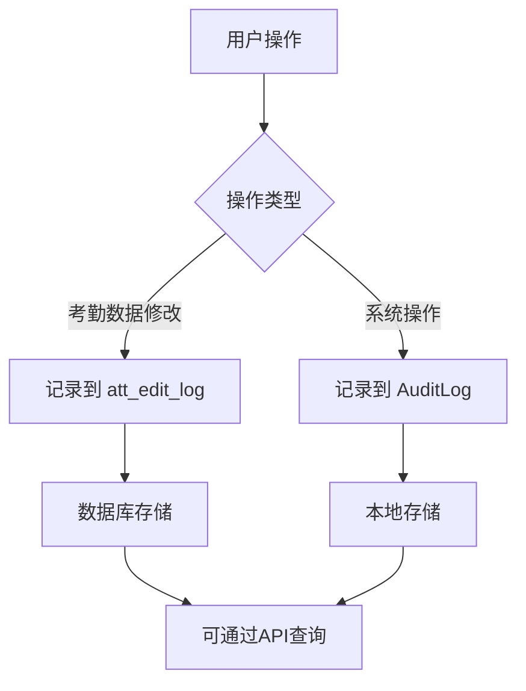
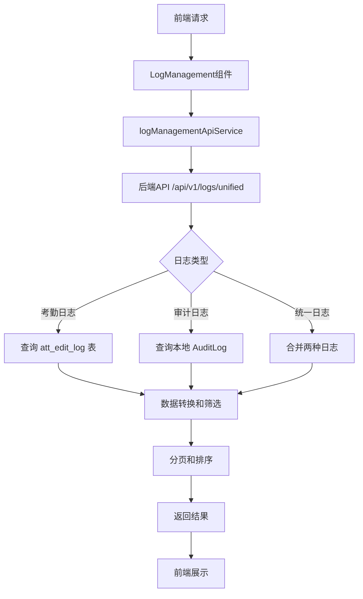

# 日志管理系统设计文档

## 概述

本文档描述了考勤管理系统中的统一日志管理系统，该系统整合了考勤编辑日志和系统审计日志，提供统一的查看、筛选、导出和管理功能。

## 系统架构

### 1. 数据层

#### 1.1 考勤编辑日志表 (`att_edit_log`)
记录所有考勤数据的修改操作：

```sql
CREATE TABLE att_edit_log (
    id BIGINT PRIMARY KEY AUTO_INCREMENT,
    company_id ENUM('eyewind', 'hydodo') NOT NULL,
    user_id VARCHAR(64) NOT NULL COMMENT '被修改员工ID',
    user_name VARCHAR(128) COMMENT '被修改员工姓名',
    attendance_date DATE NOT NULL COMMENT '考勤日期',
    edit_type ENUM('status', 'time', 'leave', 'clear', 'batch') NOT NULL,
    old_status VARCHAR(32) COMMENT '修改前状态',
    new_status VARCHAR(32) COMMENT '修改后状态',
    old_value JSONB COMMENT '修改前完整数据',
    new_value JSONB COMMENT '修改后完整数据',
    linked_proc_inst_id VARCHAR(64) COMMENT '关联的审批单ID',
    edit_reason VARCHAR(512) COMMENT '修改原因',
    editor_id VARCHAR(64) NOT NULL COMMENT '操作人ID',
    editor_name VARCHAR(128) COMMENT '操作人姓名',
    edit_time TIMESTAMP DEFAULT CURRENT_TIMESTAMP,
    client_ip VARCHAR(64) COMMENT '客户端IP',
    user_agent VARCHAR(512) COMMENT '用户代理',
    INDEX idx_company_date (company_id, attendance_date),
    INDEX idx_user_date (user_id, attendance_date),
    INDEX idx_editor (editor_id),
    INDEX idx_edit_time (edit_time)
);
```

#### 1.2 系统审计日志 (`AuditLog`)
记录用户的各种系统操作：

```typescript
interface AuditLog {
    id: string;
    userId: string;
    userName: string;
    userRole: string;
    action: string;        // LOGIN, DOWNLOAD, EDIT, SEND, RECALL, ARCHIVE, etc.
    target?: string;       // 操作对象
    details?: string;      // 操作详情
    timestamp: number;     // 时间戳
}
```

### 2. API层

#### 2.1 日志管理API (`/api/v1/logs`)

| 方法 | 路径 | 描述 |
|------|------|------|
| GET | `/api/v1/logs/attendance/:companyId` | 获取考勤编辑日志 |
| GET | `/api/v1/logs/audit` | 获取系统审计日志 |
| GET | `/api/v1/logs/unified/:companyId` | 获取统一日志（考勤+审计） |
| DELETE | `/api/v1/logs/attendance/:logId` | 删除考勤编辑日志（管理员功能） |

#### 2.2 查询参数

```typescript
interface UnifiedLogQuery {
  page?: number;          // 页码，默认1
  size?: number;          // 每页大小，默认20
  userId?: string;        // 用户ID筛选
  startDate?: string;     // 开始日期 (YYYY-MM-DD)
  endDate?: string;       // 结束日期 (YYYY-MM-DD)
  logType?: 'attendance' | 'audit' | 'all';  // 日志类型
  searchTerm?: string;    // 搜索关键词
  action?: string;        // 操作类型筛选
  editType?: string;      // 编辑类型筛选（仅考勤日志）
}
```

### 3. 服务层

#### 3.1 日志管理API服务 (`logManagementApiService`)

```typescript
class LogManagementApiService {
  // 获取考勤编辑日志
  async getAttendanceLogs(companyId: CompanyId, query: UnifiedLogQuery): Promise<LogListResponse>
  
  // 获取系统审计日志
  async getAuditLogs(query: UnifiedLogQuery): Promise<LogListResponse>
  
  // 获取统一日志
  async getUnifiedLogs(companyId: CompanyId, query: UnifiedLogQuery): Promise<LogListResponse>
  
  // 删除考勤编辑日志
  async deleteAttendanceLog(logId: string): Promise<{message: string}>
  
  // 导出日志为CSV
  async exportLogs(companyId: CompanyId, query: UnifiedLogQuery, filename?: string): Promise<void>
  
  // 获取日志统计信息
  async getLogStats(companyId: CompanyId, startDate?: string, endDate?: string): Promise<LogStats>
}
```

### 4. 组件层

#### 4.1 日志管理组件 (`LogManagement`)

**功能特性：**
- 统一查看考勤编辑日志和系统审计日志
- 支持按日志类型、用户、时间范围、操作类型筛选
- 支持关键词搜索
- 支持分页浏览
- 支持导出CSV格式
- 详细信息弹窗查看
- 响应式设计，支持暗色模式

**组件结构：**
```
LogManagement/
├── 头部工具栏
│   ├── 日志类型切换 (全部/考勤日志/审计日志)
│   ├── 筛选按钮
│   ├── 导出按钮
│   ├── 刷新按钮
│   └── 关闭按钮
├── 筛选面板 (可折叠)
│   ├── 搜索关键词
│   ├── 用户ID
│   ├── 日期范围
│   └── 操作类型
├── 日志列表
│   ├── 日志条目卡片
│   └── 加载/错误状态
├── 分页控件
└── 详情弹窗
```

#### 4.2 管理页面集成 (`AdminPage`)

在系统管理页面中添加了"日志管理"选项卡：

```
管理页面/
├── 用户管理
├── 角色权限  
├── 日志管理 ← 新增
└── 审计日志 (保留原有功能)
```

## 数据流程

### 1. 日志记录流程



### 2. 日志查询流程



## 安全考虑

### 1. 权限控制
- 只有管理员角色可以访问日志管理功能
- 删除日志操作需要特殊权限
- 记录操作人信息用于审计追踪

### 2. 数据保护
- 敏感信息在日志中进行脱敏处理
- 日志数据定期归档和清理
- 支持日志数据的备份和恢复

### 3. 访问控制
- API请求需要用户身份验证
- 记录客户端IP和用户代理信息
- 支持按公司隔离日志数据

## 性能优化

### 1. 数据库优化
- 为常用查询字段添加索引
- 支持分页查询减少数据传输
- 定期清理过期日志数据

### 2. 前端优化
- 使用虚拟滚动处理大量日志数据
- 实现搜索防抖减少API调用
- 缓存查询结果提高响应速度

### 3. API优化
- 支持批量操作减少请求次数
- 实现查询结果缓存
- 使用流式导出处理大文件

## 监控和告警

### 1. 日志统计
- 按时间段统计日志数量
- 按用户统计操作频率
- 按操作类型统计分布

### 2. 异常监控
- 监控异常操作模式
- 检测可疑的批量操作
- 记录系统错误和异常

### 3. 性能监控
- 监控API响应时间
- 跟踪数据库查询性能
- 监控存储空间使用情况

## 扩展性

### 1. 新日志类型
- 支持添加新的日志类型
- 灵活的日志字段扩展
- 可配置的日志记录规则

### 2. 多租户支持
- 支持多公司数据隔离
- 可配置的权限策略
- 灵活的数据分区方案

### 3. 集成能力
- 支持与外部系统集成
- 提供标准的日志API接口
- 支持多种数据导出格式

## 使用指南

### 1. 查看日志
1. 进入系统管理页面
2. 点击"日志管理"选项卡
3. 选择要查看的日志类型
4. 使用筛选条件缩小范围
5. 点击日志条目查看详情

### 2. 导出日志
1. 设置筛选条件
2. 点击"导出"按钮
3. 系统自动下载CSV文件

### 3. 搜索日志
1. 在搜索框输入关键词
2. 支持搜索用户名、操作详情等
3. 结合其他筛选条件精确查找

## 总结

统一日志管理系统为考勤管理系统提供了完整的操作审计和追踪能力，通过整合考勤编辑日志和系统审计日志，管理员可以全面了解系统的使用情况，确保数据安全和操作合规性。

系统采用模块化设计，具有良好的扩展性和维护性，支持多种查询和导出方式，满足不同场景下的日志管理需求。